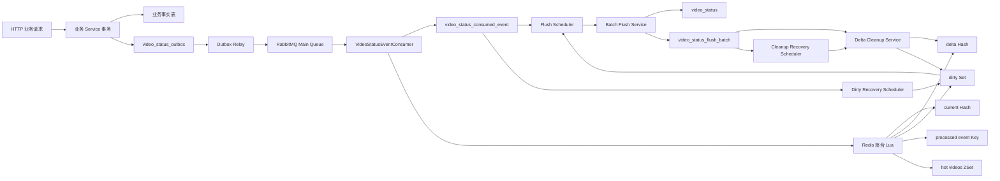
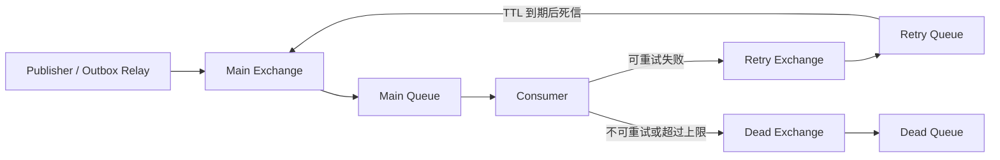
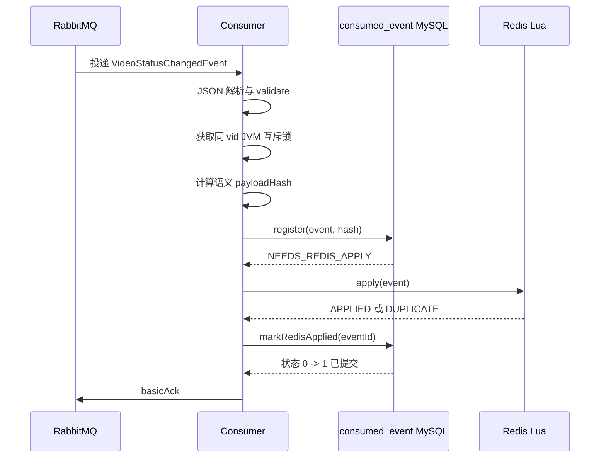
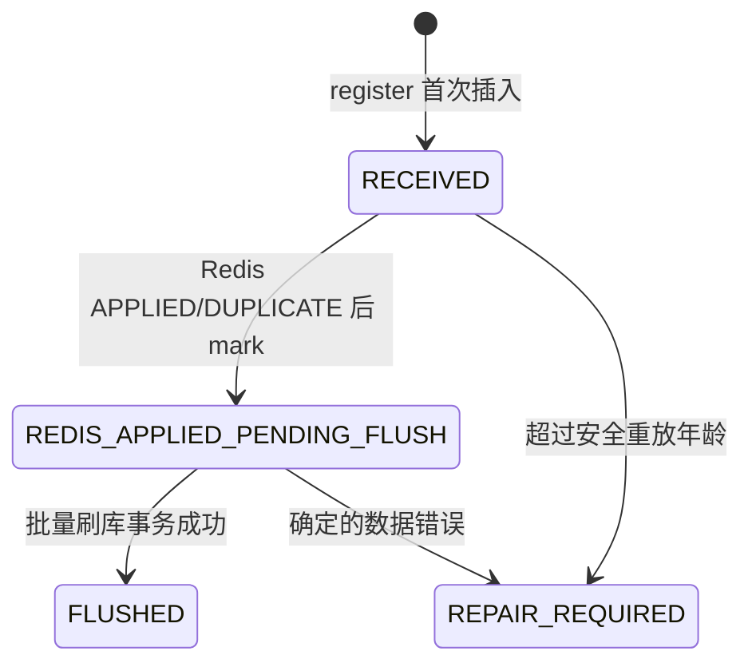
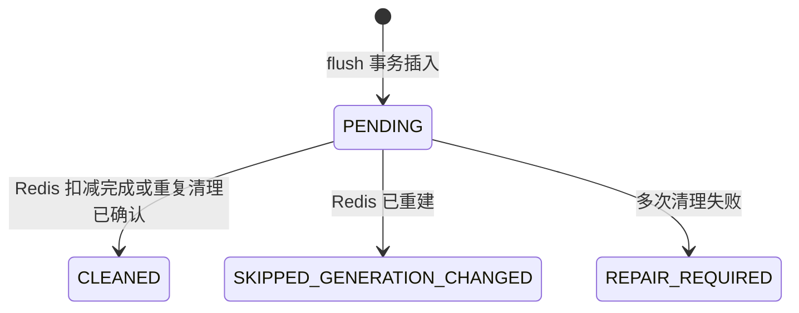

# 视频统计系统全流程原理与设计说明

## 1. 文档目的

本文档用于解释当前项目中视频统计系统的完整工作流程、核心原理和设计取舍。

这里的“视频统计”包括：

- 播放数 `playTimes`
- 点赞数 `likeTimes`
- 点踩数 `unlikeTimes`
- 评论数 `commentTimes`
- 投币数 `coinTimes`
- 分享数 `shareTimes`
- 收藏数 `collectTimes`
- 弹幕数 `danmuTimes`
- 由上述行为计算得到的热门分数 `hotScore`

本文面向以下读者：

- 正在学习 Java/Spring Boot 后端开发的开发者；
- 需要维护本项目视频统计链路的开发者；
- 希望理解 Outbox、消息幂等、Redis 实时聚合、最终一致性和批量刷库的人；
- 需要排查“Redis 和 MySQL 为什么不一致”“消息为什么进入 DLQ”等问题的人。

本文不是只罗列类和方法，而是重点回答：

1. 为什么不能在请求线程里同时更新 MySQL、Redis 和 RabbitMQ？
2. 为什么一条消息需要 MySQL 状态、Redis processed Key 和 RabbitMQ Header 三层记录？
3. Redis `current`、`delta`、`dirty` 分别解决什么问题？
4. Redis 丢失后，为什么不能由查询线程直接重建？
5. 批量刷库为什么还需要 `flush_batch` 和 `flush-cleaned` Key？
6. 每一个可能的崩溃窗口如何恢复？

## 快速阅读导航

本文较长，可以根据目标选择阅读路径：

- 想先建立整体认识：阅读第 2～4 节；
- 想理解正常消息链路：阅读第 5～9 节；
- 想理解 Redis 数据和 Lua：阅读第 10～12 节；
- 想理解批量刷库和 cleanup：阅读第 14～16 节；
- 想排查故障和崩溃恢复：阅读第 17～20 节；
- 想了解部署限制和未完成能力：优先阅读第 21、22、26 节；
- 想结合源码学习：阅读第 28 节代码导航；
- 修改代码前：检查第 29 节约束清单。

首次阅读时请特别注意：本文同时解释设计原理和当前实现。当前实现尚未具备完整的状态 0 主动恢复、状态 3 管理后台和多实例分布式锁，具体边界见第 26 节。

---

## 2. 一句话理解整个系统

这套系统使用 MySQL 保存可靠事实和处理状态，使用 RabbitMQ 解耦业务请求与统计处理，使用 Redis 提供实时统计值，再通过批量刷库把 Redis 中尚未持久化的增量合并写回 MySQL。

正常情况下，一条视频统计事件会经过下面的路径：

```text
业务事务
  -> 写业务事实
  -> 写 Outbox

Outbox Relay
  -> RabbitMQ Main Queue

消费者
  -> MySQL consumed_event 状态 0
  -> Redis 原子聚合 current/delta/dirty/hot/processed
  -> MySQL consumed_event 状态 1
  -> ACK

批量刷库
  -> 锁定状态 1 事件
  -> 聚合八项 delta
  -> 一次 UPDATE video_status
  -> 事件状态 1 -> 2
  -> 插入 flush_batch

事务提交后
  -> Redis Lua 扣减已刷入 MySQL 的 delta
  -> flush_batch 标记 CLEANED
```

这个过程采用的是最终一致性，而不是每一步都同步完成的强一致性。

消费状态速查：

| 状态 | 简称 | 含义 |
|---:|---|---|
| 0 | RECEIVED | MySQL 已登记，尚未确认 Redis 应用 |
| 1 | REDIS_APPLIED_PENDING_FLUSH | Redis 已应用，等待刷入 MySQL |
| 2 | FLUSHED | 已刷入 MySQL |
| 3 | REPAIR_REQUIRED | 自动流程停止，等待人工修复 |

cleanup 状态速查：

| 状态 | 简称 | 含义 |
|---:|---|---|
| 0 | PENDING | 等待从 Redis delta 扣减本批增量 |
| 1 | CLEANED | cleanup 已确认完成 |
| 2 | SKIPPED_GENERATION_CHANGED | Redis 已换代，旧批次跳过 |
| 3 | REPAIR_REQUIRED | 多次清理失败，等待人工修复 |

它要保证的不是“Redis 和 MySQL 在任何一个微秒都相等”，而是：

- 已经成功提交的业务行为不会永久丢失；
- 同一个 `eventId` 重复投递不会重复增加统计；
- Redis 中已经应用但尚未刷入 MySQL 的增量能够被追踪；
- MySQL 刷库成功后，即使 Redis 清理失败，也不会再次增加 MySQL；
- Redis 丢失后可以根据 MySQL 基线和消费日志安全恢复；
- 任意一步失败时，不会静默 ACK 一条尚未可靠完成的消息。

---

## 3. 总体架构



系统可以分成六层：

| 层次 | 主要组件 | 核心职责 |
|---|---|---|
| 业务写入层 | `UserVideoServiceImpl` 等业务 Service | 修改业务事实，并在同一事务创建统计事件 |
| 可靠发布层 | Outbox、Relay、Publisher | 保证业务事务提交后的事件最终能进入 RabbitMQ |
| 消费登记层 | `VideoStatusConsumptionService` | ACK 前在 MySQL 建立耐久处理记录和状态机 |
| 实时聚合层 | `VideoStatusService`、Redis Lua | 原子更新实时值、待刷增量、热门分数和幂等 Key |
| 批量持久化层 | Batch Flush Service、Scheduler | 将多条状态 1 事件合并成少量 MySQL UPDATE |
| 恢复与清理层 | Rebuild、Dirty Recovery、Cleanup | 修复 Redis 缺失、dirty 丢失和清理中断 |

---

## 4. 核心一致性模型

### 4.1 三类数据的定位

系统中存在三类重要数据：

#### 4.1.1 业务事实

例如：

- 用户是否点赞某个视频；
- 用户是否收藏某个视频；
- 用户给视频投了多少硬币；
- 某条评论或弹幕是否真实存在。

业务事实是业务真相，必须由 MySQL 事务可靠保存。

#### 4.1.2 聚合统计

例如 `video_status.like_times`。

它是对业务事件的聚合结果，不是原始事实。聚合统计允许短时间延迟，但不能永久少算或重复计算。

#### 4.1.3 实时视图

Redis `current` Hash 是面向查询的实时视图。

它比 MySQL 聚合行更新得更快，但允许在 Redis 故障时丢失，因为系统能够从 MySQL 和事件日志重建。

### 4.2 三个关键等式

在系统结构正常、没有人工修复事件的情况下，可以用下面的关系理解数据：

```text
Redis current
    = MySQL video_status 基线
    + 已经应用 Redis、但尚未刷入 MySQL 的增量

Redis delta
    = 已经应用 Redis、但尚未完成 cleanup 的增量

MySQL consumed_event 状态 1
    = 已确认应用 Redis、但尚未刷入 MySQL 的事件
```

需要注意，`Redis delta` 和“数据库状态 1 事件的聚合值”在崩溃恢复的瞬间不一定完全同步。

例如 Redis 已经成功应用，但消费者在把 MySQL 状态从 0 改成 1 前崩溃，此时：

- Redis delta 已包含该增量；
- consumed event 仍为状态 0；
- processed event Key 存在。

这正是重建逻辑必须检查状态 0 的 processed Key，而不能只查询状态 1 的原因。

### 4.3 为什么选择最终一致性

如果每次播放、点赞都同步更新 MySQL 聚合行，会产生以下问题：

- 热门视频的同一行会被频繁更新，形成行锁热点；
- 播放请求延迟会被数据库写入延迟放大；
- MySQL 吞吐量会被大量细小 UPDATE 消耗；
- Redis、MySQL 和 RabbitMQ 无法天然组成一个本地事务；
- 任一外部系统抖动都会直接影响用户请求。

因此系统把“业务事实可靠提交”和“统计结果最终完成”分开处理。

---

## 5. 阶段一：业务请求与事件创建

### 5.1 同步与异步双路径

当前业务 Service 通过 `app.video-status.async-enabled` 决定统计方式：

```text
async-enabled = false
    -> 请求事务直接更新 video_status

async-enabled = true
    -> 请求事务不直接更新聚合行
    -> 在同一事务插入 video_status_outbox
```

保留同步路径的作用是：

- 在异步链路未启用时，原有功能仍可使用；
- 灰度切换时可以快速关闭异步模式；
- 降低一次性改造整个业务层的风险。

### 5.2 为什么 `createEvent()` 使用 `Propagation.MANDATORY`

`VideoStatusServiceImpl#createEvent()` 使用：

```java
@Transactional(
        propagation = Propagation.MANDATORY,
        rollbackFor = Exception.class
)
```

`MANDATORY` 表示调用它时外层必须已经存在事务。

这样做的目的，是强制保证：

```text
业务事实修改成功
和
Outbox 插入成功
必须一起提交或一起回滚
```

如果允许在无事务环境中单独插入 Outbox，可能产生两类错误：

1. 业务事实失败，但统计事件已经发布，导致多算；
2. 业务事实成功，但 Outbox 插入失败，导致少算。

### 5.3 事件结构

统计事件使用 `VideoStatusChangedEvent`：

```text
eventId       全局事件标识，也是整个链路的幂等键
vid           视频 ID
type          PLAY、LIKE、UNLIKE、COMMENT、COIN、SHARE、COLLECT、DANMU
delta         正数或负数增量，不能为 0
hotScoreDelta 热门分数增量
occurredAt    事件发生时间
schemaVersion 消息结构版本，当前要求为 2
traceId       可选链路追踪标识
```

事件校验会确认：

- `eventId` 非空且长度不超过 64；
- `vid` 大于 0；
- `type` 非空；
- `delta` 非空且不为 0；
- `hotScoreDelta` 是有限数字；
- `hotScoreDelta` 必须等于事件类型权重乘以 `delta`；
- `occurredAt` 非空；
- `schemaVersion` 必须为 2。

热门分数权重目前为：

| 类型 | 权重 |
|---|---:|
| PLAY | 1.0 |
| LIKE | 1.5 |
| UNLIKE | -1.0 |
| COMMENT | 3.5 |
| COIN | 4.0 |
| SHARE | 2.5 |
| COLLECT | 4.0 |
| DANMU | 2.0 |

### 5.4 为什么事件必须带 `eventId`

RabbitMQ 默认提供的是至少一次投递语义。

以下场景都会产生重复消息：

- 生产者发送成功，但来不及把 Outbox 标为 SENT；
- 消费者处理成功，但 ACK 丢失；
- 消费者连接断开，RabbitMQ 重新投递未确认消息；
- Retry Queue 将消息重新送回 Main Queue；
- 人工恢复重新发布数据库中的 payload。

因此，重复不是异常，而是消息系统的正常行为。

系统不能依靠“消息只来一次”，必须依靠稳定的 `eventId` 吸收重复。

---

## 6. 阶段二：Transactional Outbox 可靠发布

### 6.1 为什么不能在业务事务里直接发送 RabbitMQ

MySQL 本地事务和 RabbitMQ Publish Confirm 不是同一个事务。

如果业务代码采用下面的顺序：

```text
更新 MySQL
-> 发送 RabbitMQ
-> 提交 MySQL
```

可能发生：

- RabbitMQ 已收到消息，但 MySQL 最终回滚；
- MySQL 已提交，但发送 RabbitMQ 失败；
- RabbitMQ Confirm 成功后进程崩溃，业务代码不知道是否应该重发。

Transactional Outbox 的核心思想是：

```text
业务事务只负责写 MySQL
把“以后需要发送的消息”也作为一条 MySQL 记录保存
```

事务提交后，再由独立 Relay 异步发送。

### 6.2 Outbox 状态

当前 Outbox 使用以下状态：

```text
0 PENDING  等待发送
1 SENDING  已被某个 Relay 实例领取
2 SENT     RabbitMQ 已确认，数据库已记录完成
3 FAILED   超过最大重试次数，需要人工处理
```

### 6.3 领取任务

`VideoStatusOutboxClaimService` 在事务中执行：

```text
SELECT PENDING
FOR UPDATE SKIP LOCKED
-> 为每条记录生成 leaseToken
-> 状态改为 SENDING
```

`SKIP LOCKED` 的作用是：

- 一个线程已经锁住的 Outbox，不会被另一个线程重复领取；
- 多个 Relay 线程可以并行领取不同记录；
- 避免所有线程在同一条记录上等待。

`leaseToken` 的作用是证明“后续状态更新仍然属于本次领取者”。

例如标记 SENT 时，SQL 不只检查 `eventId`，还检查：

```text
status = SENDING
lease_token = 本次 token
```

这样旧线程不能覆盖已经被新线程重新领取的任务。

### 6.4 Publisher Confirm 与 Return

事件发送时使用：

- 持久化消息；
- `publisher-confirm-type=correlated`；
- `publisher-returns=true`；
- `mandatory=true`；
- `CorrelationData` 等待 Confirm。

必须同时检查：

1. Broker 是否 ACK；
2. 消息是否因为没有路由到队列而 Return。

只有 Broker ACK 且消息没有 Return，才允许把 Outbox 标记为 SENT。

### 6.5 发布失败与退避

发送失败后，Outbox 会：

- 状态回到 PENDING；
- `retry_count + 1`；
- 记录 `last_error`；
- 设置下一次重试时间；
- 使用指数退避，最大延迟 300 秒。

当前最大发布重试次数为 10，超过后进入 FAILED。

### 6.6 发送租约恢复

如果 Relay 在把状态改成 SENDING 后崩溃，记录可能永久停在 SENDING。

因此 Relay 每轮会扫描超时租约：

```text
status = SENDING
且 sending_at 早于当前时间 - outboxLeaseSeconds
```

这些记录会被恢复成 PENDING，等待重新领取。

即使一条消息实际已经发送成功但 Outbox 未标记 SENT，重新发送也是安全的，因为后续消费者以 `eventId` 幂等处理。

---

## 7. 阶段三：RabbitMQ 拓扑和可靠转发

### 7.1 队列拓扑

当前使用三组 Exchange/Queue：



当前实际命名空间为 `v1`：

```text
video.status.exchange.v1
video.status.persist.queue.v1
video.status.retry.exchange.v1
video.status.retry.queue.v1
video.status.dlx.v1
video.status.dlq.v1
```

需要区分两个概念：

- 消息体的 `schemaVersion=2` 表示事件结构版本；
- Redis/RabbitMQ 名称中的 `v1` 是当前部署命名空间。

两者不是同一个版本字段。后续若正式切换命名空间，应统一规划，而不是只修改一部分常量。

### 7.2 Retry Queue 的作用

Retry Queue 不是由消费者直接监听。

消费者遇到可重试错误时，将消息可靠发布到 Retry Exchange。Retry Queue 保存一段时间，TTL 到期后通过死信配置重新路由到 Main Exchange。

它提供了简单的延迟重试，避免消费者立即原地死循环。

### 7.3 为什么业务重试次数不使用 `x-death`

系统使用自定义 Header：

```text
x-video-status-attempt
```

规则为：

```text
首次消费：0
每次转发 Retry：原值 + 1
数据库 consumer_retry_count：保存观察到的最大 attempt
是否进入 DLQ：由该 Header 和 consumerMaxRetries 判断
```

RabbitMQ 的 `x-death` 仍可以用于诊断，但不作为业务重试次数真相源。

原因是数据库恢复消息可能重新构造 RabbitMQ Message，此时历史 `x-death` 不一定完整。如果同时依赖数据库计数和 `x-death`，两套数字会产生分叉。

### 7.4 为什么 Forwarder 必须克隆原消息

转发 Retry 或 DLQ 时，代码使用克隆构建方式创建新 Message，而不是直接修改传入的原 Message。

这样可以避免：

- Retry Header 污染仍在处理中的原消息；
- DLQ 原因写入后影响后续 NACK/requeue；
- 单元测试或框架复用同一 Message 对象时出现隐式副作用。

### 7.5 ACK 的基本原则

原消息只有在下面任一情况成立时才能 ACK：

1. 正常业务流程已经完成；
2. Retry 消息已经得到 RabbitMQ Confirm；
3. DLQ 消息已经得到 RabbitMQ Confirm。

如果转发出现 NACK、Return、超时或发送异常，消费者必须：

```text
basicNack(deliveryTag, false, true)
```

即保留原消息并重新入队。

---

## 8. 阶段四：消费者完整处理流程

### 8.1 正常时序



消费者锁的范围覆盖：

```text
register
-> Redis apply
-> markRedisApplied
```

不是只锁 Lua 调用。

这样，同一个 JVM 中针对同一 `vid` 的：

- 普通消费；
- Redis 重建；
- 批量 flush；

不会交叉执行并破坏同一视频的状态关系。

### 8.2 为什么先登记 MySQL，再调用 Redis

如果先写 Redis，再登记 MySQL，进程可能在 Redis 成功后崩溃，数据库中完全没有这条事件的记录。

此时系统只剩一个短期 processed Key，无法长期判断这条增量属于什么事件，也无法进行人工修复。

因此消费者先执行 `register()`，保证 ACK 前至少有一条 MySQL 耐久记录。

### 8.3 为什么 `register()` 使用 `REQUIRES_NEW`

`register()` 是独立 Bean 中的事务方法：

```java
@Transactional(
        propagation = Propagation.REQUIRES_NEW,
        rollbackFor = Exception.class,
        noRollbackFor = RepairRequiredMessageException.class
)
```

调用返回时，登记事务已经提交，然后消费者才访问 Redis。

这样可以保证：

- Redis 成功前，状态 0 已经可靠存在；
- Redis 访问不会占用 MySQL 登记事务；
- 状态 0 超龄转状态 3 后，即使抛修复异常，状态 3 仍会提交。

`noRollbackFor` 是这里的重要设计。

如果没有它，代码先执行 `0 -> 3`，再抛出 `RepairRequiredMessageException`，Spring 会回滚整个事务，数据库最终仍然是状态 0，修复标记就失效了。

### 8.4 语义指纹为什么不能直接 Hash 原始 JSON

同一个语义事件可能因为 JSON 表现形式不同而得到不同字节：

- 字段顺序不同；
- 空格或换行不同；
- 序列化器配置不同；
- 数字表现形式不同。

因此系统按固定业务字段顺序生成语义字符串：

```text
eventId
vid
type
delta
hotScoreDelta
occurredAt
schemaVersion
traceId
```

每个字段使用长度前缀：

```text
字符长度:字段文本
```

最后对 UTF-8 字节计算 SHA-256。

长度前缀可以避免简单分隔符带来的歧义。例如：

```text
a|bc
ab|c
```

如果只拼接字符串，边界可能不明确；长度前缀能够唯一确定每个字段。

### 8.5 payload 与 payloadHash 的职责不同

`video_status_consumed_event` 同时保存：

- `payload`：完整规范事件 JSON，用于重建、恢复和审计；
- `payload_hash`：快速比较相同 `eventId` 是否仍然代表同一业务内容。

重复事件不能只比较 Hash，还要同时比较：

```text
vid
eventType
delta
payloadHash
```

这样即使未来 Hash 生成规则出现问题，也不会完全放弃业务字段校验。

---

## 9. 消费事件状态机

### 9.1 状态定义



| 状态码 | 名称 | 含义 |
|---:|---|---|
| 0 | RECEIVED | 已登记，但尚未确认 Redis 应用完成 |
| 1 | REDIS_APPLIED_PENDING_FLUSH | Redis 已确认，等待刷入 MySQL |
| 2 | FLUSHED | 已刷入 MySQL，等待或已经完成 Redis delta 清理 |
| 3 | REPAIR_REQUIRED | 自动流程停止，需要人工判断和修复 |

### 9.2 首次登记

首次 `eventId` 插入时保存：

- 完整事件字段；
- `payload`；
- `payload_hash`；
- `process_status=0`；
- `consumer_retry_count=0`；
- `last_attempt_at=NOW(3)`；
- `consumed_at=NOW(3)`。

成功后返回 `NEEDS_REDIS_APPLY`。

### 9.3 唯一键冲突不是直接成功

`event_id` 有唯一索引。

两个消费者并发处理同一事件时，不能采用：

```text
先 SELECT 不存在
-> 再 INSERT
```

因为两个线程可能同时看到“不存在”。

正确做法是直接 INSERT，让唯一索引作为最终并发防线。

发生唯一键冲突后，事务执行：

```text
selectByEventIdForUpdate(eventId)
```

锁住已有记录，再比较内容和状态。

### 9.4 重复消息的状态分支

相同内容的重复事件根据状态返回：

| 原状态 | register 结果 | 后续动作 |
|---:|---|---|
| 0 | NEEDS_REDIS_APPLY | 再次执行 Redis；processed Key 会吸收重复 |
| 1 | REDIS_ALREADY_APPLIED | 不再执行 Redis，直接按成功结束 |
| 2 | ALREADY_FLUSHED | 不再执行 Redis，直接按成功结束 |
| 3 | 抛 RepairRequired | 可靠发送 DLQ，不进入 Redis |

如果相同 `eventId` 对应不同 `vid/type/delta/hash`，说明生产端破坏了事件身份约束，消费者抛 `NonRetryableMessageException` 并进入 DLQ，不能覆盖原来的合法记录。

### 9.5 状态 0 的安全年龄

Redis processed event Key 有 TTL。

如果一条状态 0 事件沉睡时间超过 processed Key 的安全范围，再盲目重放可能发生：

```text
事件以前已经应用 Redis
-> processed Key 已过期
-> 消费者误以为从未应用
-> Redis 重复增加
```

因此状态 0 会比较：

```text
consumed_at
与
now - consumerRecoveryAutoReplayMaxAgeSeconds
```

超龄时执行条件更新 `0 -> 3`，记录错误并抛出带告警语义的修复异常。

配置还要求：

```text
consumerRecoveryAutoReplayMaxAgeSeconds
    < redisEventTtlDays * 86400
```

### 9.6 `markRedisApplied()` 的幂等

正常 SQL 为：

```text
process_status 0 -> 1
redis_applied_at = NOW(3)
last_error = NULL
```

如果影响行数为 0，不能立即认为失败，而要重新查询：

| 查询结果 | 处理 |
|---|---|
| 状态 1 | 幂等成功 |
| 状态 2 | 幂等成功 |
| 状态 0 | 暂时不一致，抛可重试异常 |
| 状态 3 | 抛人工修复异常 |
| 不存在 | 抛可重试异常 |
| 未知状态 | 抛不可重试异常 |

这使得“第一次已经改成状态 1，但调用方没有收到成功结果”的情况能够安全重试。

---

## 10. Redis 数据结构

### 10.1 当前 Key

当前代码使用以下 Key：

| Key | 类型 | 作用 |
|---|---|---|
| `video:status:v1:{vid}` | Hash | 当前实时统计值和 generation |
| `video:status:delta:v1:{vid}` | Hash | 尚未完成 cleanup 的八项增量 |
| `dirty:video:v1` | Set | 需要批量刷库的 vid 集合 |
| `video:status:process:v1:{eventId}` | String | Redis 事件幂等标记，带 TTL |
| `feed:hot:videos:v1` | ZSet | vid 到热门分数的排序集合 |
| `video:status:init-lock:v1:{vid}` | String | Redis 初始化 token 锁 |
| `video:status:flush-cleaned:v1:{batchId}` | String | cleanup 幂等标记，无 TTL |

### 10.2 current Hash

包含：

```text
vid
generation
playTimes
likeTimes
unlikeTimes
commentTimes
coinTimes
shareTimes
collectTimes
danmuTimes
```

它服务于实时查询。

`generation` 表示本轮 Redis 结构的代次。Redis 重建后会生成新的 UUID。

### 10.3 delta Hash

包含完整八个字段，即使值为 0 也保留：

```text
playDelta
likeDelta
unlikeDelta
commentDelta
coinDelta
shareDelta
collectDelta
danmuDelta
```

delta 的含义是“已经体现在 Redis current 中，但 cleanup 尚未确认完成的增量”。

### 10.4 为什么 current 和 delta 必须同时存在

聚合脚本要求二者同时存在。

如果只存在 current：

- 新事件无法安全判断哪些增量尚未刷库；
- 继续更新 current 会导致 MySQL 永远追不上。

如果只存在 delta：

- 查询没有完整实时值；
- 无法确认 delta 应该叠加在哪个基线上。

因此：

```text
两个都存在：Key 级结构成对存在
两个都不存在：允许首次初始化
只存在一个：结构不一致，必须告警并重试
```

这里的“成对存在”只表示两个 Hash Key 都存在，不代表 Hash 内部所有字段一定完整。字段级完整性由 Lua 在处理对应事件字段时继续校验；当前实现不能自动覆盖修复“Key 存在但部分字段缺失”的结构污染，详见第 26.7 节。

### 10.5 为什么 delta 为 0 时也不能删除 Hash

如果 cleanup 在 delta 全部变成 0 时删除 delta Hash，但 current 仍存在，下一条事件会看到：

```text
current 存在
delta 不存在
```

聚合脚本返回 `NEEDS_REBUILD`。

而初始化脚本发现 current 已存在，又返回 `ALREADY_INITIALIZED`。

这样会形成无法自动恢复的循环。

因此 delta Hash 必须永久保留八个零字段，只在 Redis 整体丢失或受控重建时重新创建。

### 10.6 dirty Set 的定位

dirty Set 不是事实源，只是一个减少数据库扫描的加速索引。

它表示“这个 vid 可能存在待刷库事件”。

dirty Set 可以丢失，因为 MySQL 状态 1 才是真相源，Dirty Recovery Scheduler 会重新扫描并补回。

### 10.7 processed event Key 的定位

processed Key 用于 Redis Lua 的事件级幂等：

```text
video:status:process:v1:{eventId}
```

当 Key 已存在时，Lua 返回 `DUPLICATE`，不会再次更新 current、delta、dirty 或热门分数。

它设置 TTL，是为了控制 Redis 空间。

这也解释了为什么状态 0 的自动重放年龄必须小于 processed Key TTL。

---

## 11. Redis 聚合 Lua 的设计

### 11.1 为什么必须使用 Lua

一次统计应用需要同时完成：

1. 校验 current 和 delta；
2. 检查 eventId 是否重复；
3. 检查负增量后结果是否非负；
4. 增加 current；
5. 增加 delta；
6. 把 vid 加入 dirty Set；
7. 更新热门 ZSet；
8. 写入 processed Key。

如果这些操作由 Java 分多条 Redis 命令执行，进程可能在任意两条命令之间崩溃。

例如：

```text
current 已增加
-> 进程崩溃
-> delta 未增加
```

此时实时值和待刷增量永久分叉。

Lua 在 Redis 单线程执行模型中提供脚本级原子性，脚本执行期间不会与其他 Redis 命令交叉修改这些 Key。

### 11.2 Key 和参数契约

聚合脚本 Key 顺序固定为：

```text
KEYS[1] current Hash
KEYS[2] delta Hash
KEYS[3] dirty Set
KEYS[4] processed event Key
KEYS[5] hot videos ZSet
```

参数顺序固定为：

```text
ARGV[1] current 字段名
ARGV[2] delta 字段名
ARGV[3] 统计增量
ARGV[4] vid
ARGV[5] 热门分数增量
ARGV[6] processed Key TTL 秒数
```

Lua 契约依赖位置，不依赖参数名称。Java 端 Key 或 ARGV 顺序错误，脚本仍可能执行，但会修改错误的数据，因此调用顺序必须有明确测试或代码审查保护。

### 11.3 先校验，后写入

Lua 的重要原则是：

```text
所有可能失败的校验
必须发生在第一条写命令之前
```

它先检查：

- current/delta 是否存在；
- Redis 类型是否正确；
- 字段名是否在白名单；
- 当前值、delta、热门分数和 TTL 是否可解析；
- processed Key 是否存在；
- 负增量是否会产生负数。

确认全部合法后才执行 `HINCRBY/SADD/ZINCRBY/SET`。

Redis Lua 报错不会自动回滚已经执行过的写命令，因此“先写一半再校验”是危险设计。

### 11.4 为什么先检查结构，再检查 DUPLICATE

脚本先确认 current 和 delta 完整，然后才检查 processed Key。

考虑下面的故障窗口：

```text
事件曾经成功应用
processed Key 仍存在
但 current/delta 因 Redis 故障丢失
```

如果脚本先检查 processed Key，会返回 `DUPLICATE`，消费者随后把 MySQL 标为状态 1，但 Redis 中实际没有该增量。

因此结构缺失必须优先返回 `NEEDS_REBUILD`。

### 11.5 返回值

| 返回值 | 含义 |
|---|---|
| APPLIED | 本次首次应用成功 |
| DUPLICATE | eventId 已应用，不重复增加 |
| NEEDS_REBUILD | current/delta 缺失或字段不可解析，需要初始化 |
| NEGATIVE_RESULT | 负增量会让当前统计小于 0 |
| INVALID_FIELD | Java 传入了不允许的 Hash 字段 |
| INVALID_REDIS_TYPE | Key 类型被污染 |

消费者对 `APPLIED` 和 `DUPLICATE` 都执行 `markRedisApplied()`。

这是因为最关键的崩溃恢复窗口就是：

```text
Redis APPLIED
-> 进程崩溃
-> MySQL 仍为状态 0
-> 重投后 Lua 返回 DUPLICATE
-> 再把状态 0 改为 1
```

---

## 12. Redis 安全初始化与重建

### 12.1 什么时候触发重建

实时聚合第一次返回 `NEEDS_REBUILD` 时：

```text
ensureInitialized(vid)
-> 聚合脚本只重试一次
```

如果重建后仍然返回 `NEEDS_REBUILD`，抛可重试异常，不无限循环。

当前 `ensureInitialized()` 的首次快速判断是 current/delta 两个 Key 是否同时存在。若两个 Key 都存在，但 Hash 内部缺少某个字段，重建服务会认为 Key 级结构已经初始化。等事件命中缺失字段时，聚合 Lua 会返回 `NEEDS_REBUILD`，但普通初始化不会覆盖已有 current。此类局部字段损坏当前应视为结构污染并人工修复，而不是普通首次初始化。

### 12.2 为什么查询线程不参与重建

查询 `getByVid()` 的策略是：

```text
Redis current 存在
    -> 返回 Redis

Redis current 不存在
    -> 只查询 MySQL
    -> 记录 Redis miss
    -> 不写 Redis
```

不让查询线程重建有以下原因：

- 查询流量远高于消费和运维流量，Redis 故障时会产生重建风暴；
- 查询线程不掌握消息处理上下文；
- 重建需要读取 MySQL 和 processed Key，耗时不可控；
- 用户读请求不应该承担系统修复职责；
- 多个查询线程同时重建会增加锁竞争和故障复杂度。

因此查询路径只负责降级读取，重建由消费、flush 或受控运维流程触发。

### 12.3 JVM 条带锁

`VideoStatusVidMutex` 使用固定 256 把 `ReentrantLock`：

```text
index = Math.floorMod(vid, locks.length)
```

同一 vid 一定落在同一把锁上。

不同 vid 可能落在同一条带上，因此理论上会有少量无关等待，但避免了为每个 vid 永久创建一把锁。

这里不能使用“从 Map 动态创建锁，解锁后删除”的实现。

因为等待线程仍持有旧锁引用时，新线程可能创建另一把锁，导致同一 vid 同时被两把锁保护，互斥失效。

`ReentrantLock` 是可重入的，所以消费者已经持有 vid 锁时，调用内部也使用该互斥器的 Redis apply/rebuild 不会死锁。

### 12.4 Redis 初始化锁

JVM 锁只能保护当前进程。初始化还使用 Redis token 锁：

```text
SET init-lock token NX EX 10s
```

未获得锁时，线程短暂等待并重新检查 current/delta。如果仍不存在，抛可重试异常，让上层稍后重试。

释放锁时不能直接：

```text
DEL lockKey
```

因为原锁可能已经超时，新线程已经获得同名锁。旧线程直接删除会误删新锁。

正确方式是 compare-and-delete Lua：

```lua
if GET(lockKey) == token then
    DEL(lockKey)
end
```

### 12.5 为什么 Snapshot Service 必须是独立 Bean

重建快照使用：

```java
@Transactional(
        readOnly = true,
        isolation = Isolation.REPEATABLE_READ
)
```

事务中需要读取：

1. `video_status` MySQL 基线；
2. 同 vid 的状态 0/1 候选事件及 payload。

事务方法放在独立 `VideoStatusRebuildSnapshotServiceImpl` Bean 中，再由 Rebuild Service 注入调用。

如果写成：

```java
this.loadSnapshot()
```

属于同类自调用，不会经过 Spring 事务代理，`@Transactional` 不生效。

独立 Bean 调用的边界是：

```text
进入 Snapshot Bean 代理
-> 开启 REPEATABLE_READ 只读事务
-> 读取基线和候选事件
-> 聚合为普通 Java DTO
-> 方法返回
-> 事务结束
-> Rebuild Service 再访问 Redis
```

这样不会在 MySQL 只读事务内等待 Redis。

### 12.6 状态 0/1 的重建分类

候选事件分类规则：

| 事件状态 | processed Key | 是否计入 pending delta |
|---:|---|---|
| 1 | 任意 | 一定计入 |
| 0 | 存在 | 计入 |
| 0 | 不存在 | 不计入 |

原因如下。

#### 状态 1

状态 1 表示消费者已经确认 Redis APPLIED 或 DUPLICATE，因此一定属于尚未刷库的 pending delta。

#### 状态 0 且 processed Key 存在

这表示可能发生了：

```text
Redis 已成功
-> 状态 1 落库前崩溃
```

Redis current/delta 丢失时，必须把这条增量重新纳入初始化值。

#### 状态 0 且 processed Key 不存在

无法证明 Redis 曾经应用。

如果贸然计入，后续消息重新投递时还会应用一次，造成重复增加。因此暂不计入，等待消息重投。

### 12.7 为什么 hotScoreDelta 从 payload 解析

重建候选中的 `hotScoreDelta` 从规范化 payload 反序列化获得。

不能只根据 `event_type` 和 `delta` 临时推断，因为 payload 才是当时已校验并持久化的完整事件事实。

如果未来热门权重算法变化，使用当前代码重新推断历史事件可能得到不同结果。

### 12.8 初始化结果

初始化计算：

```text
current = MySQL 基线 + 已确认应用的 pending delta
delta   = 已确认应用的 pending delta
```

初始化 Lua 原子写入：

- current 完整字段；
- delta 完整八字段；
- 新 generation UUID；
- dirty Set 成员关系；
- hot ZSet 分数。

只有 current 不存在时允许初始化。

如果 current 和 delta 只缺一个，Java 在执行 Lua 前就会告警并抛可重试异常，不会用普通消费线程强行覆盖正式数据。

---

## 13. 查询路径与降级

查询只读取 `current` Hash。

```text
current 存在
-> 转换为 VideoStatus 返回

current 不存在
-> 查询 MySQL video_status 返回
```

这种策略的优点：

- Redis 正常时提供低延迟实时数据；
- Redis 故障时仍能返回持久化基线；
- 查询线程不会制造 Redis 写流量；
- Redis 重建与用户读请求解耦。

代价是 Redis 缺失时，查询结果可能暂时不包含尚未刷入 MySQL 的增量。

这是可用性优先的降级选择：返回稍旧但可靠的 MySQL 数据，好过让查询失败或触发并发重建风暴。

---

## 14. 批量刷库设计

### 14.1 为什么要批量刷库

假设一个热门视频一秒产生 1000 次播放。

如果每条消息都执行：

```sql
UPDATE video_status
SET play_times = play_times + 1
WHERE vid = ?;
```

同一行会产生大量锁竞争和日志写入。

批量刷库会把多条事件聚合成：

```sql
UPDATE video_status
SET play_times = play_times + 1000
WHERE vid = ?;
```

这样显著减少 MySQL UPDATE 次数。

### 14.2 flush 的事务边界

`flushOneVideo()` 在一个 MySQL 事务内完成：

```text
selectPendingForUpdate
-> 聚合 VideoStatusDelta
-> applyBatchDelta
-> markFlushed
-> insert flush_batch
-> 提交事务
```

这几步必须同事务，因为不能出现：

- MySQL 聚合行已增加，但事件仍是状态 1；
- 事件已标状态 2，但聚合行没有增加；
- 事件和聚合行都完成，但没有 cleanup 任务记录。

### 14.3 状态 1 事件的锁定

查询使用：

```text
WHERE vid = ?
  AND process_status = 1
ORDER BY 正增量优先, id
LIMIT ?
FOR UPDATE SKIP LOCKED
```

`SKIP LOCKED` 使不同 flush 事务不会锁到同一批事件。

正增量优先的原因是降低负增量在小批次边界上违反非负约束的概率。

例如同一视频先产生 `+1 收藏`，后产生 `-1 收藏`。如果批次只取到负事件，而 MySQL 当前仍为 0，UPDATE 会失败；优先处理正增量更符合事件累计的安全顺序。

它不能取代非负保护，只是降低不必要的修复事件。

### 14.4 八项固定聚合

每条 consumed event 先转换为固定结构：

```text
VideoStatusDelta(
    playDelta,
    likeDelta,
    unlikeDelta,
    commentDelta,
    coinDelta,
    shareDelta,
    collectDelta,
    danmuDelta
)
```

然后执行 `plus()` 聚合。

禁止根据消息字段动态拼接 SQL 列名，因为动态列名：

- 难以审计；
- 容易引入 SQL 注入或字段映射错误；
- 无法让 MyBatis 清晰校验参数；
- 新增类型时容易漏掉非负约束。

### 14.5 非负保护

`applyBatchDelta()` 同时更新八个字段，并在 WHERE 中检查更新后仍然非负。

不能使用：

```sql
GREATEST(value + delta, 0)
```

把非法负增量静默截断为 0。

静默截断会隐藏上游事件错误，使 consumed event 显示“已完成”，但实际统计没有按事件执行。

正确行为是 UPDATE 影响 0 行，抛 `VideoStatusFlushDataException`。

### 14.6 数据错误与瞬时错误必须区分

确定的数据错误，例如：

- 聚合后违反非负约束；
- consumed event 包含未知事件类型；

处理方式：

```text
当前 flush 事务回滚
-> REQUIRES_NEW 将本批状态 1 事件改为状态 3
-> 不清理 Redis delta
-> 根据剩余状态 1 刷新 dirty Set
```

瞬时错误，例如：

- 数据库连接超时；
- 死锁；
- 事务超时；

处理方式：

```text
事务回滚
-> vid 重新加入 dirty Set
-> 下一轮重试
```

瞬时基础设施问题不能误标成人工修复，否则一次短暂数据库抖动会制造大量状态 3。

### 14.7 净增量为 0

如果一批事件聚合后八项净增量全部为 0：

- 跳过 `video_status UPDATE`；
- 仍把事件标为状态 2；
- 仍插入 flush batch；
- 后续 cleanup 按零增量执行幂等清理流程。

因为这些事件虽然互相抵消，但仍然需要完成状态迁移和审计闭环。

---

## 15. flush_batch 与 Redis delta 清理

### 15.1 为什么 MySQL 提交后还需要 cleanup

flush 事务提交后，MySQL `video_status` 已经包含本批增量。

Redis `current` 不需要减少，因为它代表最新实时总值。

Redis `delta` 需要减去本批已经持久化的增量，否则后续重建会再次把这些增量叠加到 MySQL 基线上。

### 15.2 为什么 cleanup 不能放在 flush 的 MySQL 事务里

MySQL 和 Redis 没有共同本地事务。

如果在 MySQL 事务提交前调用 Redis cleanup：

```text
Redis delta 已扣减
-> MySQL 提交失败
```

该增量既不在 MySQL，也不在 Redis delta，数据丢失。

因此顺序固定为：

```text
MySQL flush 事务提交
-> 再执行 Redis cleanup
```

一旦 MySQL 提交，cleanup 失败只能重试 cleanup，绝不能再次调用 `applyBatchDelta()`。

### 15.3 flush batch 状态机



| 状态码 | 名称 | 含义 |
|---:|---|---|
| 0 | PENDING | MySQL 已刷库，等待 Redis delta 清理 |
| 1 | CLEANED | delta 已安全处理 |
| 2 | SKIPPED_GENERATION_CHANGED | Redis 已换代，旧批次不再扣减 |
| 3 | REPAIR_REQUIRED | 清理多次失败，需要人工检查 |

### 15.4 batch 记录保存什么

`video_status_flush_batch` 保存：

- `batchId`；
- `vid`；
- flush 时读取到的 `redisGeneration`；
- 八项已刷入 MySQL 的 delta；
- cleanup 状态和重试次数；
- 错误、创建时间、清理时间。

它是“MySQL 已经提交了哪些增量”的耐久证明。

### 15.5 generation 防止旧批次扣减新 Redis

考虑：

```text
批次 A 已刷入 MySQL
-> cleanup 尚未完成
-> Redis 整体丢失并重建
-> 新 Redis delta 已根据 MySQL 新基线重新计算
```

如果批次 A 继续从新 delta 中扣减，会把新结构扣错。

因此 flush batch 保存当时 current Hash 的 generation。

cleanup Lua 比较：

```text
batch.redisGeneration
与
current.generation
```

不一致时返回 `GENERATION_CHANGED`，数据库把批次标为跳过，不执行扣减。

### 15.6 cleanup 的事务和行锁

`cleanup(batchId)` 使用 `REQUIRES_NEW`，并先执行：

```text
selectByBatchIdForUpdate(batchId)
```

它串行化同一个 batch 的清理。

即使两个线程同时扫描到同一 PENDING 批次，也只有一个线程能通过行锁继续执行 Lua；后一个线程重新读取时会看到 CLEANED 或其他终态。

### 15.7 为什么还需要 flush-cleaned Redis Key

仅依赖 MySQL 行锁仍无法覆盖这个窗口：

```text
Redis delta 已扣减
-> 进程崩溃
-> MySQL cleanup_status 事务未提交
```

数据库仍然是 PENDING，下一次会再次执行 Lua并重复扣减。

因此 Lua 在成功扣减后写入：

```text
video:status:flush-cleaned:v1:{batchId}
```

再次执行同一 batch 时，Lua 看到 Key，返回 `DUPLICATE_CLEANUP`，不重复扣减。

### 15.8 为什么 flush-cleaned Key 不设置 TTL

如果 Key 有 TTL，而 MySQL 故障持续时间超过 TTL：

```text
Redis 已扣减
-> MySQL 长时间无法提交 CLEANED
-> Key 过期
-> 再次执行 cleanup
-> 重复扣减
```

因此该 Key 无 TTL。

只有在 MySQL `cleanup_status=CLEANED` 成功提交后，Java 才在 `afterCommit` 回调中尽力删除它。

删除失败只会产生一个无害的空间泄漏，不会造成数据重复。

### 15.9 cleanup Lua 返回值

| 返回值 | 处理 |
|---|---|
| EMPTY | delta 已清零，SREM dirty，标 CLEANED |
| REMAINING | 仍有其他 delta，SADD dirty，标 CLEANED |
| DUPLICATE_CLEANUP | 以前已扣减，直接标 CLEANED |
| GENERATION_CHANGED | 标 SKIPPED_GENERATION_CHANGED |
| NEEDS_REBUILD | 记录失败，保持 PENDING 或最终转 REPAIR_REQUIRED |
| INVALID_ARGUMENT | 记录失败，保持 PENDING 或最终转 REPAIR_REQUIRED |

---

## 16. 三个调度器

### 16.1 Flush Scheduler

每轮执行：

```text
SPOP dirty Set 最多 N 个 vid
-> 对每个 vid 获取 JVM 条带锁
-> 读取 current.generation
-> generation 缺失时 ensureInitialized
-> flushOneVideo
-> MySQL 事务返回后 cleanup(batchId)
-> 查询 MySQL 是否仍有状态 1
-> 决定是否重新 SADD dirty
```

使用 SPOP 而不是只读取成员，可以避免同一轮不断重复处理同一个 vid。

如果线程在 SPOP 后崩溃，Dirty Recovery Scheduler 会从 MySQL 恢复。

### 16.2 Dirty Recovery Scheduler

它定期执行：

```text
SELECT DISTINCT vid
FROM consumed_event
WHERE process_status = 1
LIMIT N
```

然后把这些 vid 重新加入 dirty Set。

这体现了一个重要原则：

```text
MySQL 状态 1 是事实
dirty Set 只是索引
```

### 16.3 Cleanup Recovery Scheduler

它定期扫描：

```text
flush_batch.cleanup_status = PENDING
```

然后逐批调用 `cleanup(batchId)`。

每个 batch 单独捕获错误，一个坏批次不会阻止后续批次处理。

### 16.4 调度开关

三个调度器需要同时满足：

```text
app.video-status.async-enabled = true
app.video-status.scheduling-enabled = true
```

默认保持关闭，避免代码尚未完成联调时处理真实数据。

---

## 17. 失败分类和消息处理策略

### 17.1 可重试错误

例如：

- Redis 暂时不可用；
- MySQL 连接超时；
- 数据库死锁；
- Redis 初始化锁正被其他线程持有；
- Redis 重建后暂时仍未就绪；
- mark 状态时出现暂时不一致。

处理方式：

```text
尽力记录 consumer_retry_count 和 last_error
-> 未超过上限：可靠转发 Retry
-> 超过上限：可靠转发 DLQ
-> Confirm 成功后 ACK 原消息
```

记录失败信息本身如果失败，只记录日志，不能覆盖原始业务异常。

### 17.2 不可重试错误

例如：

- JSON 无法解析；
- schemaVersion 不支持；
- 同一 eventId 对应不同业务内容；
- Redis 字段或类型被污染；
- 未知消费状态。

处理方式是可靠进入 DLQ，不做无意义的自动重试。

### 17.3 人工修复错误

例如：

- 状态 0 超过安全重放年龄；
- 事件已经是状态 3；
- 确定的数据错误导致批量刷库无法满足非负约束；
- cleanup 多次失败。

这类错误的特点是：继续自动重试可能扩大数据问题，因此要停止普通自动流程，保留证据等待人工判断。

---

## 18. 关键崩溃窗口分析

### 18.1 业务事务已提交，Outbox 尚未发送

```text
业务事实 + Outbox 已提交
-> 应用崩溃
```

恢复方式：Relay 下次扫描 PENDING Outbox 并发送。

结果：不会丢事件。

### 18.2 RabbitMQ 已收到，Outbox 尚未标 SENT

```text
Publish Confirm 成功
-> 进程崩溃
-> Outbox 仍是 SENDING
```

恢复方式：租约超时后恢复 PENDING，再次发送。

结果：可能重复发布，但消费者 eventId 幂等吸收。

### 18.3 consumed event 状态 0 已提交，Redis 尚未执行

```text
register 已提交状态 0
-> 进程崩溃
```

恢复方式：RabbitMQ 未收到 ACK，会重新投递。register 读取状态 0，未超龄则继续 Redis apply。

结果：不会丢事件。

### 18.4 Redis APPLIED，状态 1 尚未提交

```text
current/delta/dirty/hot/processed 已更新
-> 进程崩溃
-> MySQL 仍是状态 0
```

恢复方式：

- 正常重投时 Lua 返回 DUPLICATE，再执行 `markRedisApplied()`；
- current/delta 丢失但 processed Key 尚存时，重建逻辑发现状态 0 且 processed Key 存在，把增量计入快照；
- 如果 Redis 整体丢失，processed Key 也一起丢失，状态 0 不会被快照直接计入，需要依赖 RabbitMQ 重投后重新执行 apply。

这是全链路中最关键的恢复窗口之一。

### 18.5 状态 1 已提交，ACK 尚未发送

```text
MySQL 状态 1 已提交
-> 进程崩溃
```

恢复方式：重投后 register 返回 REDIS_ALREADY_APPLIED，不再调用 Redis，直接按成功结束并 ACK。

### 18.6 flush UPDATE 已执行，事务尚未提交

```text
video_status 已在事务内增加
-> 进程崩溃或 SQL 后续失败
```

恢复方式：MySQL 回滚整个事务，事件仍为状态 1，也不会留下 flush batch。dirty Recovery 会再次调度。

### 18.7 flush 事务已提交，cleanup 尚未执行

```text
video_status 已增加
事件已状态 2
flush_batch=PENDING
-> 进程崩溃
```

恢复方式：Cleanup Recovery Scheduler 扫描 PENDING batch，只重试 Redis cleanup，不再次更新 MySQL。

### 18.8 Redis cleanup 已执行，MySQL CLEANED 尚未提交

```text
delta 已扣减
flush-cleaned Key 已写入
-> 进程崩溃
-> batch 仍是 PENDING
```

恢复方式：下次 Lua 返回 DUPLICATE_CLEANUP，MySQL 标 CLEANED，不重复扣减。

### 18.9 Redis 重建发生在旧 batch cleanup 前

```text
旧 batch 保存 generation A
Redis 重建为 generation B
```

恢复方式：cleanup Lua 返回 GENERATION_CHANGED，旧批次标记跳过。

### 18.10 初始化锁过期后旧线程释放锁

```text
线程 A 获得 token A
-> 锁过期
线程 B 获得 token B
线程 A 执行释放
```

恢复方式：compare-and-delete 发现 Redis 中是 token B，不执行 DEL。

---

## 19. 多层幂等为什么不是重复设计

系统存在多层幂等：

| 层次 | 幂等标识 | 解决的问题 |
|---|---|---|
| Outbox | eventId 唯一键、leaseToken | 可靠发布和领取竞争 |
| consumed event | eventId 唯一键、payloadHash | 消费登记和业务内容冲突 |
| Redis apply | processed event Key | 避免实时统计重复增加 |
| markRedisApplied | 条件状态更新 | 避免状态重复迁移 |
| batch flush | 状态 1 行锁、状态条件 | 避免同一事件重复刷库 |
| delta cleanup | batchId 行锁、flush-cleaned Key | 避免 Redis delta 重复扣减 |
| Redis rebuild | generation | 避免旧批次影响新 Redis |

这些层次对应的是不同的失败窗口，不能互相替代。

例如 consumed event 的 eventId 唯一键只能证明“数据库登记过”，不能证明 Redis 是否已经应用；processed Key 只能证明 Redis 短期内应用过，不能代替长期 MySQL 审计记录。

---

## 20. 事务边界总览

| 方法/流程 | 事务 | 原因 |
|---|---|---|
| 业务 Service | 普通业务事务 | 业务事实与 Outbox 原子提交 |
| `createEvent()` | MANDATORY | 禁止脱离业务事务单独创建 Outbox |
| Outbox claim | 普通事务 | SELECT 锁与 SENDING/leaseToken 一起提交 |
| `register()` | REQUIRES_NEW | Redis 前先提交状态 0；状态 3 异常不回滚 |
| `markRedisApplied()` | REQUIRES_NEW | Redis 成功后独立提交状态 1 |
| `recordConsumerFailure()` | REQUIRES_NEW | 原业务事务失败时仍尽力保存错误 |
| Snapshot `load()` | readOnly + REPEATABLE_READ | 在一致视图中读取基线与候选事件 |
| `flushOneVideo()` | 普通独立事务 | UPDATE、状态 2、flush batch 原子提交 |
| `markRepairRequired()` | REQUIRES_NEW | flush 回滚后独立把坏事件转状态 3 |
| `cleanup()` | REQUIRES_NEW | 锁定单 batch 并提交 cleanup 状态 |

需要特别注意 Spring AOP 的限制：

```text
同一个类中的 this.method() 自调用
不会经过事务代理
```

因此需要真正独立事务或只读快照的方法，应放在独立 Bean 中，或者通过代理对象调用。

---

## 21. 并发模型和部署限制

### 21.1 当前允许的并发

当前设计允许：

- 同一 JVM 增加 RabbitMQ 消费线程；
- 不同 vid 并行处理；
- Outbox 使用 `SKIP LOCKED` 并行领取；
- cleanup 使用 batch 行锁防止同批并发。

### 21.2 当前不支持直接多实例

`VideoStatusVidMutex` 只在当前 JVM 内有效。

普通消费、flush 和重建依赖同一 vid 互斥关系，因此当前版本不能直接横向启动第二个应用实例。

MySQL 行锁和 Redis Lua 能保护部分局部操作，但不能完整替代跨流程的同 vid 顺序约束。

多实例前需要：

- 将 vid 锁替换为真正的分布式锁；
- 锁必须支持租约续期；
- 解锁必须校验 token；
- 明确锁超时后的任务中断或 fencing token 策略；fencing token 是单调递增的隔离令牌，下游只接受更新令牌，用来阻止已经失去锁的旧线程继续写入；
- 重新验证消费者、flush、重建之间的锁顺序。

仅使用一个固定 TTL 的 `SET NX`，却没有续租和 fencing，不足以安全保护长事务。

---

## 22. 配置和安全启用顺序

关键配置包括：

```yaml
app:
  video-status:
    async-enabled: false
    scheduling-enabled: false
    redis-event-ttl-days: 30
    consumer-max-retries: 5
    consumer-recovery-auto-replay-max-age-seconds: 604800
    flush-dirty-batch-size: 100
    flush-event-batch-size: 1000
    cleanup-max-attempts: 10

spring:
  rabbitmq:
    listener:
      simple:
        auto-startup: false
```

推荐启用顺序：

1. 保持 `async-enabled=false`、`scheduling-enabled=false`、Listener 关闭；
2. 确认数据库表、Mapper XML 和 Lua Bean 可以加载；
3. 启动 Redis 和独立 RabbitMQ vhost；
4. 检查 Redis Key 中不存在旧结构污染；
5. 设置 `async-enabled=true`；
6. 设置 `scheduling-enabled=true`；
7. 设置 Listener `auto-startup=true`；
8. 第一版保持单消费者；
9. 从单个 PLAY 事件开始验证完整链路；
10. 确认 consumed event、flush batch、delta 和 dirty 状态正确后再提高流量。

不要在未知队列中直接 purge 旧消息。联调应使用独立 vhost 或独立命名空间。

---

## 23. 一条 PLAY 事件的完整例子

假设：

```text
vid = 100
MySQL play_times = 20
Redis current.playTimes = 20
Redis delta.playDelta = 0
```

### 23.1 业务事务

创建事件：

```text
eventId = E1
type = PLAY
delta = 1
hotScoreDelta = 1.0
schemaVersion = 2
```

同一业务事务插入 Outbox。

### 23.2 发布

Relay 领取 Outbox，发送 RabbitMQ，Confirm 成功后标 SENT。

### 23.3 消费登记

消费者插入：

```text
event_id = E1
process_status = 0
payload = 完整事件 JSON
payload_hash = 语义 SHA-256
```

### 23.4 Redis 聚合

Lua 原子执行：

```text
current.playTimes: 20 -> 21
delta.playDelta:    0 -> 1
dirty Set:          加入 100
hot score:          +1.0
processed E1:       写入并设置 TTL
```

### 23.5 状态 1

MySQL consumed event：

```text
process_status: 0 -> 1
```

随后消费者 ACK。

### 23.6 批量刷库

Scheduler 取出 vid 100，锁定 E1，聚合得到：

```text
playDelta = 1
其他 delta = 0
```

事务中：

```text
MySQL play_times: 20 -> 21
E1 状态: 1 -> 2
插入 flush batch B1
```

### 23.7 cleanup

Lua 校验 generation 后：

```text
delta.playDelta: 1 -> 0
dirty Set: 移除 100
写入 flush-cleaned B1
```

MySQL 把 B1 标记 CLEANED，事务提交后尽力删除 flush-cleaned B1。

最终：

```text
MySQL play_times = 21
Redis current.playTimes = 21
Redis delta.playDelta = 0
consumed event E1 = FLUSHED
flush batch B1 = CLEANED
```

---

## 24. 负增量例子

假设收藏事件：

```text
type = COLLECT
delta = -1
```

Redis Lua 会先检查：

```text
current.collectTimes + delta >= 0
```

如果当前收藏数为 0，返回 `NEGATIVE_RESULT`，不会写入任何 Redis Key。

如果 Redis 允许应用，但后续 MySQL 基线因历史不一致导致批量 UPDATE 非负检查失败：

- flush 事务整体回滚；
- 本批状态 1 事件转状态 3；
- Redis current/delta 暂时保留；
- 不执行 cleanup；
- 等待人工核对业务事实和聚合数据。

这种做法比直接把结果截断为 0 更可审计。

---

## 25. 可观测性与排障建议

当前代码已经记录部分日志和 Redis 查询 miss 计数。为了进入生产环境，建议继续补充 Micrometer 指标。

建议指标：

```text
video_status_outbox_pending_total
video_status_outbox_failed_total
video_status_consumer_retry_total
video_status_consumer_dlq_total
video_status_consumed_state_count{status}
video_status_redis_apply_total{result}
video_status_redis_rebuild_total{result}
video_status_query_redis_miss_total
video_status_flush_events_total
video_status_flush_batch_size
video_status_flush_failure_total{type}
video_status_cleanup_total{result}
video_status_cleanup_pending_total
video_status_dirty_set_size
```

建议告警：

- consumed event 状态 0 持续增长；
- 状态 3 出现；
- Outbox FAILED 出现；
- cleanup PENDING 长时间不下降；
- current/delta 只存在一个；
- Redis 重建频率异常升高；
- DLQ 持续增长；
- dirty Set 很大但 flush 吞吐量很低。

排查顺序建议：

1. 根据 `eventId` 查询 Outbox；
2. 查询 consumed event 的状态、payload、retry 和 last_error；
3. 检查 processed Key；
4. 检查 current/delta/generation；
5. 查询相关 flush batch；
6. 检查 RabbitMQ Main/Retry/DLQ 数量；
7. 再判断是发布、消费、刷库、cleanup 还是重建问题。

---

## 26. 当前实现边界

截至本文档对应代码，核心链路已经覆盖到本地联调阶段，但仍有以下边界。

### 26.1 尚未完成主动状态 0 恢复

当前普通消息重投可以恢复状态 0，但还没有阶段 11 的定时扫描器主动读取长期停留的状态 0 并重新发布 payload。

如果消息已经不在 RabbitMQ，状态 0 可能需要人工检查。

### 26.2 尚未完成状态 3 管理后台

状态 3 已能阻止普通自动流程继续处理，但还没有完整的：

- 分页查询接口；
- RESUME/IGNORE 管理动作；
- 操作日志和权限控制；
- 按 eventId 去重的告警管理页面。

### 26.3 DLQ 仍需要人工运营闭环

DLQ 提供至少一次告警载体，但系统还需要管理端或运维流程对 DLQ 消息按 `eventId` 去重展示和处理。

### 26.4 仅支持单应用实例

同 vid 的完整互斥依赖 JVM 条带锁。未替换为带续租和 token/fencing 的分布式锁前，不应直接部署多个应用实例共同消费和 flush。

### 26.5 Redis/RabbitMQ 命名空间仍为 v1

事件结构已经要求 `schemaVersion=2`，但当前 Redis Key 和 RabbitMQ 名称仍使用 `v1` 后缀。

这不影响当前代码运行，但正式迁移时需要明确：

- 是否继续复用现有命名空间；
- 是否创建全新 v2 Key/Queue；
- 如何迁移旧消息和旧 Redis 数据；
- 如何执行回滚。

### 26.6 还未执行真实基础设施端到端验证

本文整理时，当前未提交工作树执行过：

```text
mvn.cmd -DskipTests compile
mvn.cmd test
```

当时结果为 135 个主源码文件编译成功、25 个现有测试通过。这个结果只描述本文整理时的工作树，不等同于绑定某个 Git 提交，也不能替代 MySQL 8、Redis、RabbitMQ 独立环境中的端到端联调。后续每次修改都应重新执行验证。

### 26.7 Hash 局部字段损坏不能自动重建

当前聚合 Lua 只校验本次事件对应的 current 字段和 delta 字段，`ensureInitialized()` 的快速判断只检查 current/delta 两个 Key 是否存在。

因此可能出现：

```text
current 和 delta 两个 Key 都存在
但某个不常用字段被人工删除或异常损坏
```

未命中该字段的其他事件可能继续处理；命中缺失字段时 Lua 返回 `NEEDS_REBUILD`，但普通初始化因为两个 Key 都存在而直接返回，无法自动覆盖正式 Key。

当前处理原则是告警并人工修复。若要实现自动恢复，需要增加完整字段校验和“受控覆盖重建”流程，且必须与消费者、flush、generation 和分布式锁规则一起设计，不能让普通消费线程直接删除或覆盖已有 Hash。

---

## 27. 设计思想总结

这套系统的核心不是某一个框架或 Lua 脚本，而是下面这些设计原则。

### 27.1 事实与缓存分离

MySQL 保存业务事实、消费状态和刷库证明；Redis 是可重建的实时视图。

### 27.2 至少一次投递配合幂等

不追求脆弱的“绝不重复”，而是允许重复并在每个关键边界吸收重复。

### 27.3 每个跨系统边界都保留耐久证据

- Outbox 证明需要发布；
- consumed event 证明已经登记；
- processed Key 证明 Redis 已应用；
- flush batch 证明 MySQL 已刷入哪些 delta；
- flush-cleaned Key 证明 Redis 已扣减。

### 27.4 事务只覆盖单一资源

MySQL 事务负责 MySQL 原子性，Redis Lua 负责 Redis 原子性，RabbitMQ Confirm 负责发布确认。系统不假装它们共享一个分布式事务，而是用状态机和补偿恢复跨资源一致性。

### 27.5 失败必须可分类

瞬时错误重试，确定的数据错误进入修复，不可解析或身份冲突的消息进入 DLQ。不能用一个 `catch (Exception)` 把所有失败都无限重试。

### 27.6 恢复逻辑不能依赖查询流量

查询只读和降级；重建、dirty 恢复、cleanup 恢复由专门服务和调度器负责。

### 27.7 优先保证不重复和不丢失

允许短时间数据延迟，允许留下少量安全的幂等 Key，但不允许因为追求“看起来干净”而删除恢复证据、重复更新 MySQL 或重复扣减 Redis。

---

## 28. 代码导航

| 模块 | 当前路径 |
|---|---|
| 事件定义 | `src/main/java/com/feibijiubi/backend/event/VideoStatusChangedEvent.java` |
| 事件类型与权重 | `src/main/java/com/feibijiubi/backend/event/VideoStatusEventType.java` |
| 业务事件创建、Redis apply、查询 | `src/main/java/com/feibijiubi/backend/service/impl/video/videostatus/VideoStatusServiceImpl.java` |
| Outbox 领取 | `src/main/java/com/feibijiubi/backend/mq/VideoStatusOutboxClaimService.java` |
| Outbox 发布 | `src/main/java/com/feibijiubi/backend/mq/VideoStatusOutboxRelay.java` |
| Rabbit Publisher | `src/main/java/com/feibijiubi/backend/mq/VideoStatusEventPublisher.java` |
| 最终消费者 | `src/main/java/com/feibijiubi/backend/mq/VideoStatusEventConsumer.java` |
| Retry/DLQ 转发 | `src/main/java/com/feibijiubi/backend/mq/VideoStatusMessageForwarder.java` |
| 语义指纹 | `src/main/java/com/feibijiubi/backend/service/impl/video/videostatus/VideoStatusEventFingerprintServiceImpl.java` |
| 消费状态机 | `src/main/java/com/feibijiubi/backend/service/impl/video/videostatus/VideoStatusConsumptionServiceImpl.java` |
| Redis 重建 | `src/main/java/com/feibijiubi/backend/service/impl/video/videostatus/VideoStatusRebuildServiceImpl.java` |
| 重建快照事务 | `src/main/java/com/feibijiubi/backend/service/impl/video/videostatus/VideoStatusRebuildSnapshotServiceImpl.java` |
| JVM vid 互斥器 | `src/main/java/com/feibijiubi/backend/service/video/videostatus/VideoStatusVidMutex.java` |
| 批量刷库 | `src/main/java/com/feibijiubi/backend/service/impl/video/videostatus/VideoStatusBatchFlushServiceImpl.java` |
| delta 清理 | `src/main/java/com/feibijiubi/backend/service/impl/video/videostatus/VideoStatusDeltaCleanupServiceImpl.java` |
| Flush Scheduler | `src/main/java/com/feibijiubi/backend/mq/VideoStatusBatchFlushScheduler.java` |
| Dirty Recovery | `src/main/java/com/feibijiubi/backend/mq/VideoStatusDirtyRecoveryScheduler.java` |
| Cleanup Recovery | `src/main/java/com/feibijiubi/backend/mq/VideoStatusDeltaCleanupScheduler.java` |
| 聚合 Lua | `src/main/resources/lua/video-status-increment.lua` |
| 初始化 Lua | `src/main/resources/lua/video-status-init.lua` |
| delta 清理 Lua | `src/main/resources/lua/video-status-delta-subtract.lua` |
| 安全解锁 Lua | `src/main/resources/lua/compare-and-delete.lua` |
| 数据库结构 | `database/feibijiubi.sql` |

---

## 29. 核心检查清单

修改这套链路时，至少检查以下约束：

- [ ] 业务事实和 Outbox 是否同事务提交？
- [ ] eventId 是否稳定且全局唯一？
- [ ] 重复 eventId 是否同时比较业务字段和语义 Hash？
- [ ] ACK 前是否已经完成 MySQL 登记、Redis 确认和状态 1 提交？
- [ ] Retry/DLQ 是否得到 Confirm 后才 ACK 原消息？
- [ ] Redis Lua 是否在第一条写命令前完成全部校验？
- [ ] current 和 delta 是否始终成对存在？
- [ ] delta 为 0 时是否仍保留完整 Hash？
- [ ] 查询未命中是否只回源 MySQL，而不触发重建？
- [ ] 重建快照事务是否通过独立 Bean 调用？
- [ ] 状态 0 重建是否检查 processed Key？
- [ ] flush UPDATE、状态 2 和 flush batch 是否同事务？
- [ ] MySQL flush 提交后是否绝不再次重复 UPDATE？
- [ ] cleanup 是否校验 generation？
- [ ] cleanup 是否有 batch 行锁和 flush-cleaned 幂等 Key？
- [ ] flush-cleaned Key 是否只在 MySQL CLEANED 提交后删除？
- [ ] 数据错误和瞬时错误是否采用不同分支？
- [ ] dirty Set 丢失后是否能从 MySQL 状态 1 恢复？
- [ ] 多实例部署前是否已经替换 JVM 锁？

只要其中一项被破坏，就可能在某个崩溃窗口产生少算、重复统计或无法恢复的数据不一致。
